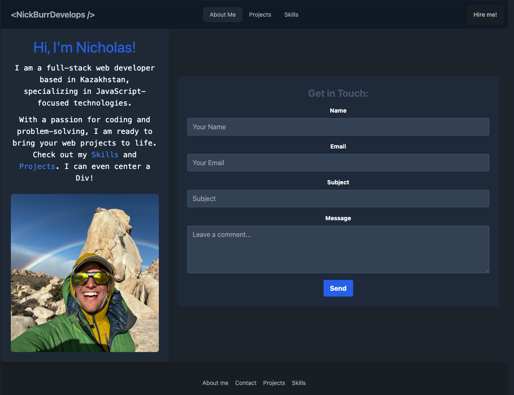

# Nicholas Burr's React Portfolio

This is a single-page application built using React, showcasing my work as a full-stack web developer. The site is designed to present my projects, skills, and professional details to potential employers and collaborators.

## Live Deployment
This portfolio is deployed at Nicholas Burr's Portfolio.

## Screenshot


## Features

- **Responsive Design:** A fully responsive web portfolio that adapts to different screen sizes.
- **Single-Page Application:** Smooth navigation without page reloads for different sections: About Me, Portfolio, Contact, and Resume.
- **Interactive Elements:** Interactive contact form with validation and dynamic section highlighting.

## Sections

- **About Me:** Introduces myself with a photo and a short bio.
- **Portfolio:** Displays my projects with links to live sites and GitHub repositories.
- **Contact:** Contains a form for visitors to send messages.
- **Resume:** Provides a link to my downloadable resume and lists my proficiencies.
- **Footer:** Includes links to my GitHub, LinkedIn, and another professional platform.

## Technologies Used

- React.js
- Tailwind CSS
- DaisyUI (for components like Carousel)
- React Router (for SPA navigation)
- Other relevant technologies...

## Setup and Installation

To run this project locally, clone the repository and install the dependencies:

```bash
git clone https://github.com/your-repository.git
cd your-repository
npm install
npm start
```


##Contributions
Contributions are not welcome, this is my portfolio. Issues or feature requests are ok though!


##License
This project is MIT licensed.

##Contact
Nicholas Burr - Email

